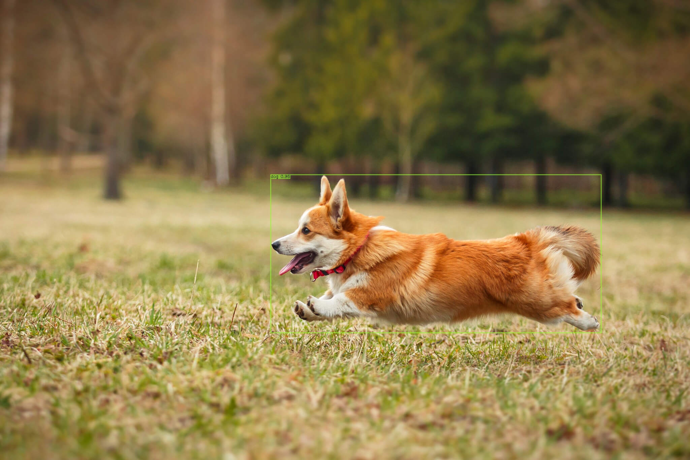
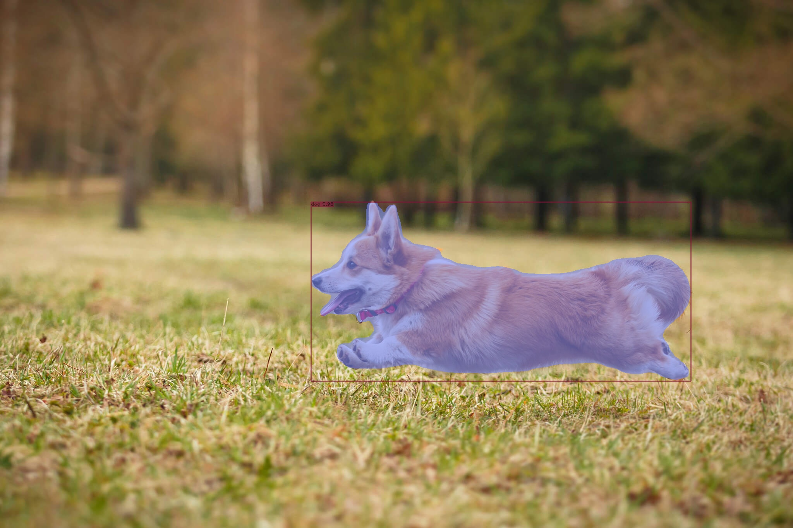
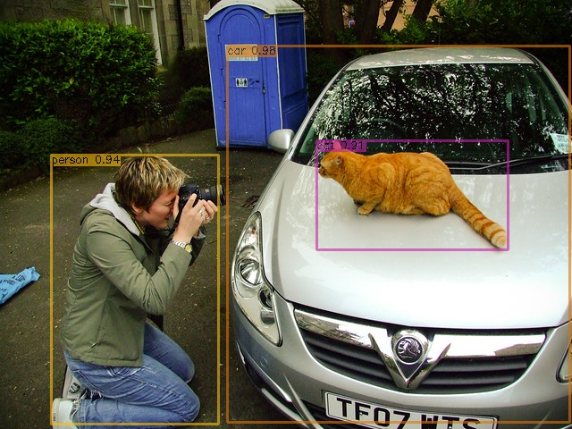
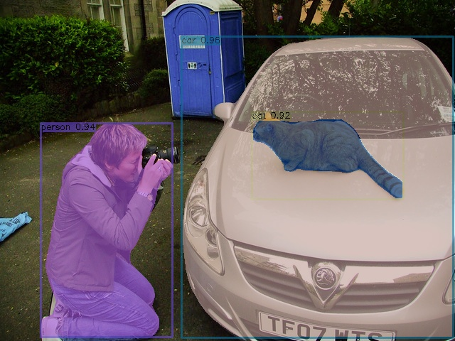

# yolov8-onnxruntime

**C++ YOLOv8 ONNXRuntime** inference code for *Object Detection* or *Instance Segmentation*.

**Support for custom training model deployment !!!**
## Demo

YOLOv8m and yolov8m-seg:

<p align="center">
 <a href="Imgoutput/demo2_m.jpg"></a> 
 <a href="Imgoutput/demo2_ms.jpg"></a> 
 </p> 

 <p align="center"> 
 <a href="Imgoutput/test1_m.jpg"></a>
 <a href="Imgoutput/test1_ms.jpg"></a>
 </p>

## My Dependecies:
- OpenCV 4.2
- ONNXRuntime 1.15.
- OS: Windows or Linux
- CUDA 12.0 [Optional]
- YOLOv8 export with onnx 1.14. opset 17

## Build

Find the compiled package for your system on the [official website](https://github.com/microsoft/onnxruntime/releases), then unzip it and replace the extracted file path with the following *path/to/onnxruntime*

```bash
mkdir build
cd build
cmake .. -DONNXRUNTIME_DIR=path/to/onnxruntime -DCMAKE_BUILD_TYPE=Debug
make
cd ..
# And you can just do this
# sh build.sh
```

## Run
You should convert your PyTorch model (.pt) to ONNX (.onnx).

The [official tutorial](https://docs.ultralytics.com/modes/export/) may help you.

Make sure you have added OpenCV libraries in your environment.

Run in Linux
```bash
./build/yolov8_ort -m ./models/yolov8m.onnx -i ./Imginput -o ./Imgoutput -c ./models/coco.names -x m --gpu

./build/yolov8_ort -m ./models/yolov8m-seg.onnx -i ./Imginput -o ./Imgoutput -c ./models/coco.names -x ms --gpu

# for your custom model
./build/yolov8_ort -m ./models/modelname.onnx -i ./Imginput -o ./Imgoutput -c ./models/class.names -x ms --gpu
#-m Path to onnx model.
#-i Image source to be predicted.
#-o Path to save result.
#-c Path to class names file.
#-x Suffix names for save.
#--gpu Whether inference on cuda device if you have.
```
For Windows
```bash
./build/yolov8_ort.exe -m ./models/modelname.onnx -i ./Imginput -o ./Imgoutput -c ./models/class.names -x ms --gpu
```


## References

- ONNXRuntime Inference examples: https://github.com/microsoft/onnxruntime-inference-examples
- YOLO v8 repo: https://docs.ultralytics.com/
